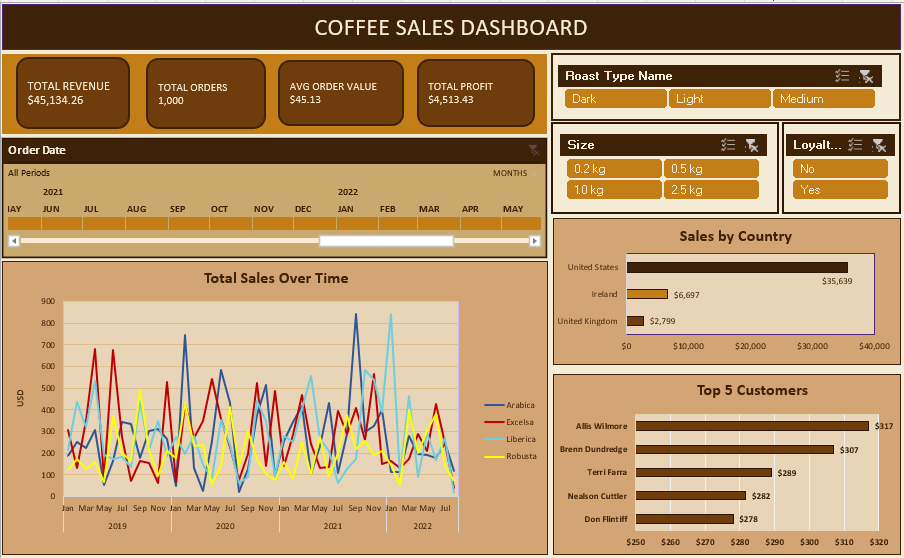

# ☕ Coffee Sales Dashboard — Interactive Excel Dashboard

## 📌 Project Overview

An interactive Excel dashboard analyzing 1,000 coffee sales transactions 
across three markets — United States, Ireland and United Kingdom — 
spanning January 2019 to August 2022.

This project was completed as a guided learning exercise and 
significantly extended with custom features including live KPI cards, 
profit analysis, a custom espresso brown theme and dedicated 
analysis sheets.

---

## 🗂️ What's Inside the Workbook

| Sheet | Description |
|---|---|
| Dashboard | Main interactive dashboard with charts and slicers |
| KPI | Live formula cells powering the KPI cards |
| orders | Raw orders data with all lookup columns resolved |
| customers | Customer reference table |
| products | Product reference table |
| TotalSales | Pivot table for Sales Over Time chart |
| CountryBarChart | Pivot table for Sales by Country chart |
| Top5Customers | Pivot table for Top 5 Customers chart |

---

## ✨ Dashboard Features

- **4 Live KPI Cards** — Total Revenue, Total Orders, 
  Average Order Value and Total Profit — linked to dynamic 
  formula cells that auto-update when data changes
- **Timeline Slicer** — Filter all charts by date range
- **3 Interactive Slicers** — Filter by Roast Type, 
  Package Size and Loyalty Card status
- **3 Pivot Charts** — Sales Over Time, Sales by Country, 
  Top 5 Customers — all connected to slicers
- **Custom Theme** — Professional espresso brown color scheme

---

## 📊 Key Insights

- 💰 **Total Revenue:** $45,134.26 across 1,000 orders
- 🇺🇸 **US dominates** with $35,639 — 79% of total revenue
- 🇮🇪 **Ireland** generated $6,697 despite smaller market size
- 🇬🇧 **UK** contributed $2,799 with growth potential
- 📦 **2.5kg packages** are the highest revenue size category
- 👥 **Top customer** Allis Wilmore contributed $317 in sales
- 💳 **Loyalty vs Non-Loyalty** revenue split is nearly equal 
  — suggesting the loyalty programme needs review

---

## 🛠️ Tools & Techniques Used

- **Microsoft Excel** — Primary tool
- **XLOOKUP & IF functions** — Data transformation 
  and table merging
- **Pivot Tables & Pivot Charts** — Data aggregation 
  and visualization
- **Slicers & Timeline** — Interactive filtering
- **Shape-linked formula cells** — Live KPI cards
- **Custom Slicer Styles** — Theme-matched filtering UI
- **Power Query concepts** — Data cleaning and preparation

---

## 📁 Files in This Repository

| File | Description |
|---|---|
| `coffee-sales-dashboard.xlsx` | Full Excel workbook with dashboard |
| `dashboard-preview.png` | Screenshot of the finished dashboard |

---

## 👤 Author

**Vakula Reddy**
- 📧 vakulaa2k@gmail.com
- 📍 Toronto, Ontario
- 💼 AI & Data Analyst

---

## 🚀 How to Use

1. Download `coffee-sales-dashboard.xlsx`
2. Open in **Microsoft Excel** (2016 or later recommended)
3. Go to the **Dashboard** tab
4. Use the slicers and timeline to explore the data interactively
